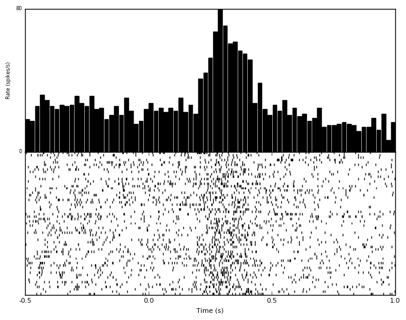
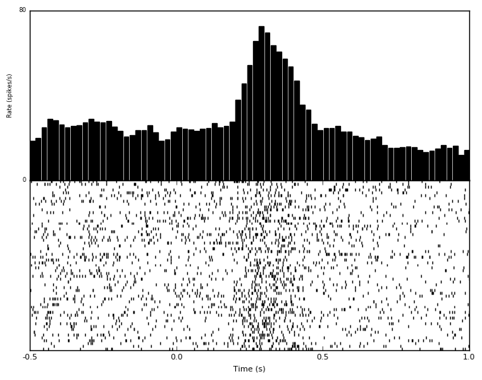

#############################
Firing Rate Characterization
#############################

*********
Overview
*********

A common model of spike generation is that of a Poisson point process, which generates action potentials as a function of an underlying rate function. This "firing rate" can be affected by behavior, stimuli, nearby neurons, past history of spiking, and many other factors. Consequently, it can be useful to estimate the underlying firing rate from the spike train of a neuron for easy comparison between experimental conditions.

Firing rate can be estimated from one spike train or from an ensemble average of spike train generated under the same conditions (like a repeated stimulation, repeated movement etc). 

************************
Firing Rate Calculation
************************

===========
Histogram
===========

The number of spikes in some span of time could be converted to the number of spikes per second, or firing rate. If we have multiple trials of spike trains, we could average the number of spikes that are present in a given window of time, and then divide by the time window size to determine the number of spikes per second for a given time instant. 

This is the most classic method for determining firing rate and is simple to implement. The drawback is that the rate depends on binsize: too large of a binsize will average out meaningful firing rate modulations, while too small of a binsize will maintain meaning firing rate modulations while not appropriately averaging out flucuations due to noise. Selecting a binsize is like estimating how quickly one expects the underlying firing rate function to be changing. Note that there are several assumptions as part of this process, such as the existance of the underlying rate itself, and the timescale of its changes. 

Even with these drawbacks, calculating firing rate with histogram-based methods is very simple to implement and can easily be repeated with a variety of binsizes very quickly. Additionally, the "optimal" binsize that can maximize noise averaging while maintaining the underlying firing rate can be estimated.

---------------
Predefined bin
---------------

-----------------
Optimal binwidth
-----------------

Shimazaki H. and Shinomoto S., A Method for Selecting the Bin Size of a Time Histogram. Neural Computation (2007). 19(6), 1503-1527.

==============
Kernel Density
==============

Histogram methods do not usually produce firing rate functions that smoothly transition over time. This is partially due to edge effects, where spikes that occur near the boundary of the artifically chosen bins will either be assigned to one bin or the other. This effect can be remedied by allowing the rate at a given point to be a function of the number of spikes at that particular instant, as well as the number of surrounding spikes in time. This will produce a rate function that is smooth in time.

The drawback to these methods is that they are somewhat dependent on what window function is chosen, and that usually these window functions are symmetric and will consequently incorporate information about future spiking, which the physical neuron certainly doesn't have access to. Additionally, the window function will have a size, which presents a similar problem as the binsize above: large windows will average out meaningful modulations, and small windows will overemphasize rate modulations due to noise.

The most typical window function is a gaussian. It is easy to use and familiar. Other windows could be chosen, like acausal windows that will not incorporate future spikes, but these can present their own problems like time delays.

Like the histogram method, there are ways to estimate the "optimal" width of the kernel for smoothing. There are also methods to chose multiple windows in the time of interest, such that times where there is rapid fluctuations in spike counts will use small windows to capture these changes, and periods with few changes in spike counts will use long windows.

-----------------
Predefined width
-----------------

--------------
Optimal width
--------------

Shimazaki H. and Shinomoto S., Kernel Bandwidth Optimization in Spike Rate Estimation. Journal of Computational Neuroscience (2010) Vol. 29 (1-2) 171-182

-------------------------------
Locally-adaptive optimal width
-------------------------------

Shimazaki H. and Shinomoto S., Kernel Bandwidth Optimization in Spike Rate Estimation. Journal of Computational Neuroscience (2010) Vol. 29 (1-2) 171-182

************
Single Unit
************

-----------------------------
Peri-Stimulus Time Histogram
-----------------------------

***********
Population
***********

----------------------------------------
Population Peri-Stimulus Time Histogram
----------------------------------------

